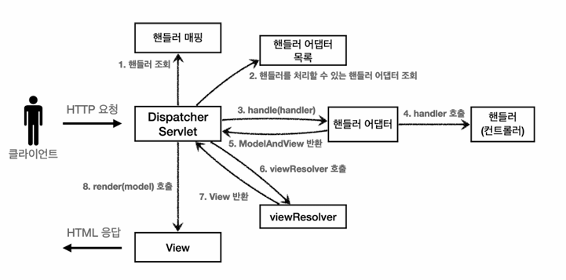

Servlet에 대한 이해

1.1.1 서블릿과 JSP의 한계

서블릿으로 개발할 때는 뷰(View)화면을 위한 HTML을 만드는 작업이 자바 코드에 섞여서 지저분하고 복잡했다.
JSP를 사용한 덕분에 뷰를 생성하는 HTML 작업을 깔끔하게 가져가고, 중간중간 동적으로 변경이 필요한 부분에만 자
바 코드를 적용했다. 그런데 이렇게 해도 해결되지 않는 몇가지 고민이 남는다.
회원 저장 JSP를 보자. 코드의 상위 절반은 회원을 저장하기 위한 비즈니스 로직이고, 나머지 하위 절반만 결과를
HTML로 보여주기 위한 뷰 영역이다. 회원 목록의 경우에도 마찬가지다.
코드를 잘 보면, JAVA 코드, 데이터를 조회하는 리포지토리 등등 다양한 코드가 모두 JSP에 노출되어 있다. JSP가 너
무 많은 역할을 한다. 이렇게 작은 프로젝트도 벌써 머리가 아파오는데, 수백 수천줄이 넘어가는 JSP를 떠올려보면 정
말 지옥과 같을 것이다. (유지보수 지옥 썰)

1.1.2 MVC 패턴 - 개요

*너무 많은 역할

하나의 서블릿이나 JSP만으로 비즈니스 로직과 뷰 렌더링까지 모두 처리하게 되면, 너무 많은 역할을 하게되고, 결과적
으로 유지보수가 어려워진다. 비즈니스 로직을 호출하는 부분에 변경이 발생해도 해당 코드를 손대야 하고, UI를 변경
할 일이 있어도 비즈니스 로직이 함께 있는 해당 파일을 수정해야 한다. HTML 코드 하나 수정해야 하는데, 수백줄의 자
바 코드가 함께 있다고 상상해보라! 또는 비즈니스 로직을 하나 수정해야 하는데 수백 수천줄의 HTML 코드가 함께 있
다고 상상해보라.

*변경의 라이프 사이클

사실 이게 정말 중요한데, 진짜 문제는 둘 사이에 변경의 라이프 사이클이 다르다는 점이다. 예를 들어서 UI를 일부 수정
하는 일과 비즈니스 로직을 수정하는 일은 각각 다르게 발생할 가능성이 매우 높고 대부분 서로에게 영향을 주지 않는
다. 이렇게 변경의 라이프 사이클이 다른 부분을 하나의 코드로 관리하는 것은 유지보수하기 좋지 않다. (물론 UI가 많
이 변하면 함께 변경될 가능성도 있다.)

*기능 특화

특히 JSP 같은 뷰 템플릿은 화면을 렌더링 하는데 최적화 되어 있기 때문에 이 부분의 업무만 담당하는 것이 가장 효과
적이다.

* Model View Controller
MVC 패턴은 지금까지 학습한 것 처럼 하나의 서블릿이나, JSP로 처리하던 것을 컨트롤러(Controller)와 뷰(View)라
는 영역으로 서로 역할을 나눈 것을 말한다. 웹 애플리케이션은 보통 이 MVC 패턴을 사용한다.

*컨트롤러 : HTTP 요청을 받아서 파라미터를 검증하고, 비즈니스 로직을 실행한다. 그리고 뷰에 전달할 결과 데이터를
조회해서 모델에 담는다.

*모델 : 뷰에 출력할 데이터를 담아둔다. 뷰가 필요한 데이터를 모두 모델에 담아서 전달해주는 덕분에 뷰는 비즈니스 로
직이나 데이터 접근을 몰라도 되고, 화면을 렌더링 하는 일에 집중할 수 있다.

*뷰 : 모델에 담겨있는 데이터를 사용해서 화면을 그리는 일에 집중한다. 여기서는 HTML을 생성하는 부분을 말한다.

1.1.3 MVC Framework

위 패턴이 스프링으로 넘어가서도 어느정도 유지된다.

1.1.4 Spring MVC structure

스프링 MVC의 구조는 MVC 프레임워크랑 구조는 비슷하지만 FrontController의 기능을 DispacherServlet이 대체한다.
